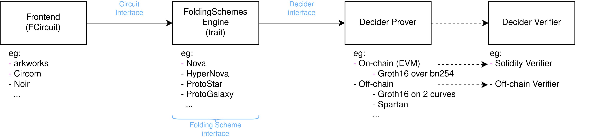

# sonobe

Experimental folding schemes library implemented in a joint effort by [0xPARC](https://0xparc.org/) and [PSE](https://pse.dev).

 
<b>Sonobe</b> is a modular library to fold circuit instances in an Incremental Verifiable computation (IVC) style, which allows to generate a zkSNARK proof of the circuit foldings that can be verified in Ethereum's EVM.
  
<i>"The <a href="https://en.wikipedia.org/wiki/Sonobe">Sonobe module</a> is one of the many units used to build modular origami. The popularity of Sonobe modular origami models derives from the simplicity of folding the modules, the sturdy and easy assembly, and the flexibility of the system."</i>

 

*(img is temporary, will replace it by a better one)* 

 

> **Warning**: experimental code, do not use in production. 
> The code has not been audited, and we have pending to implement several optimizations. The focus so far has been on implementing from scratch Nova + CycleFold and achieving onchain (EVM) verification.

## Schemes implemented
The library uses [arkworks](https://github.com/arkworks-rs), and implements the following folding schemes:

- [Nova: Recursive Zero-Knowledge Arguments from Folding Schemes](https://eprint.iacr.org/2021/370.pdf), Abhiram Kothapalli, Srinath Setty, Ioanna Tzialla. 2021
- [CycleFold: Folding-scheme-based recursive arguments over a cycle of elliptic curves](https://eprint.iacr.org/2023/1192.pdf), Abhiram Kothapalli, Srinath Setty. 2023

Work in progress:

- [HyperNova: Recursive arguments for customizable constraint systems](https://eprint.iacr.org/2023/573.pdf), Abhiram Kothapalli, Srinath Setty. 2023
- [ProtoGalaxy: Efficient ProtoStar-style folding of multiple instances](https://eprint.iacr.org/2023/1106.pdf), Liam Eagen, Ariel Gabizon. 2023

### Available frontends
Available frontends to define the folded circuit:

- [arkworks](https://github.com/arkworks-rs), arkworks contributors
- [Circom](https://github.com/iden3/circom), iden3, 0Kims Association

## Usage
Usage and design documentation can be found at https://privacy-scaling-explorations.github.io/sonobe-docs/

### Folding Schemes introduction

[introductory text here (TODO)]

### Overview of sonobe
Suppose that the user inputs a circuit that follows the IVC structure, chooses which Folding Scheme to use (eg. Nova), and which Decider (eg. Spartan over Pasta curve).

Later the user can for example change with few code changes the Folding Scheme being used (eg. switch to ProtoGalaxy) and also the Decider (eg. Groth16 over bn254), so the final proof can be verified in an Ethereum smart contract.

Complete examples can be found at [folding-schemes/examples](https://github.com/privacy-scaling-explorations/sonobe/tree/main/folding-schemes/examples)

Check out [Sonobe docs](https://privacy-scaling-explorations.github.io/sonobe-docs/) for more details on usage and design.

## License
https://github.com/privacy-scaling-explorations/sonobe/blob/main/LICENSE

[TODO: add references to
- arkworks
- Espresso code regarding the multilinear 'virtual polynomial' and SumCheck used in HyperNova
- Solidity KZG & Groth16 original adapted code
    - Groth16: Jordi Baylina
    - KZG10: weijiekoh
    - Templating: Han
- People who helped us: Srinath Setty, Lev57, Matej (Lurk), Adrien (Lurk), Wyatt Benno TODO
]
